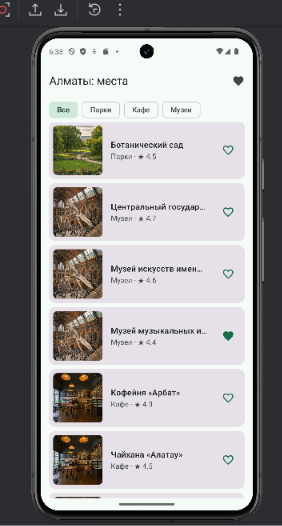
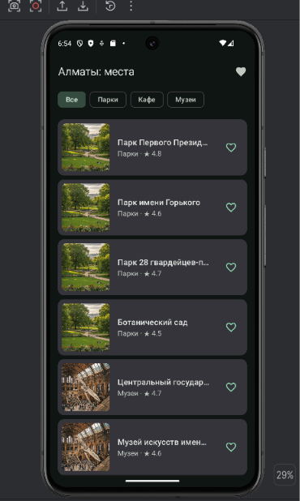
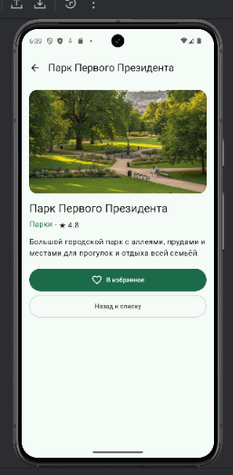
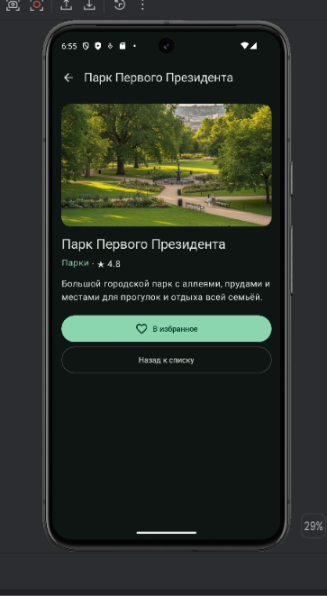
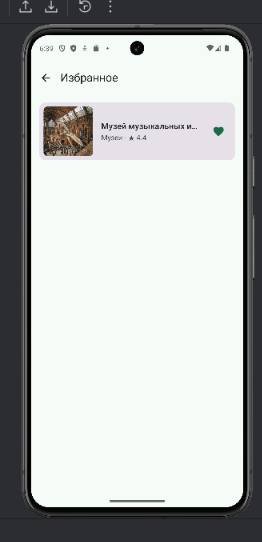
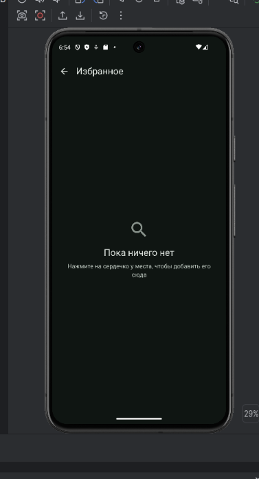
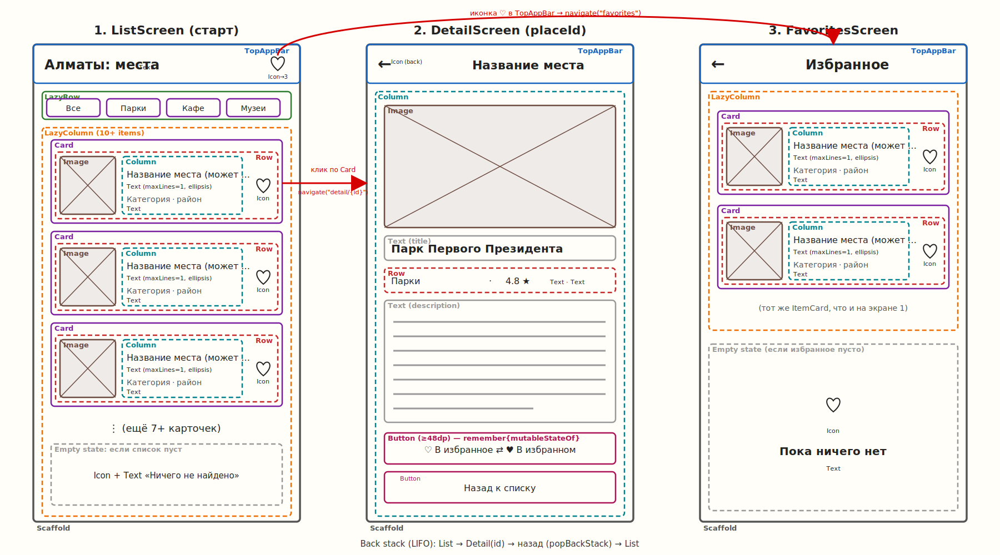

# Алматы: места

Android-приложение на Jetpack Compose: каталог интересных мест Алматы с фильтром по категориям, экраном деталей и избранным.

## Скриншоты

| Экран | Светлая тема | Тёмная тема |
|---|---|---|
| Список |  |  |
| Детали |  |  |
| Избранное |  |  |

## Эскиз и приложение

Эскиз лежит в `design/sketch.png`.

Что изменилось по сравнению с эскизом:
- Эскиз был сделан с помощью Claude и добавлен первым коммитом. Я проверил его и понял каждый блок.
- (Напиши свои отличия, например: заголовок в приложении слева, а не по центру; кнопка «Назад к списку» внизу экрана деталей.)

## Что реализовано

- 3 экрана: список, детали, избранное (Navigation Compose, id передаётся аргументом `detail/{placeId}`)
- `LazyColumn` (10 мест) и `LazyRow` (чипы категорий)
- `Scaffold` + `TopAppBar` на каждом экране, кнопка «Назад» на втором и третьем
- Многоточие для длинных названий, пустое состояние
- Своя цветовая схема (светлая и тёмная), отступы в объекте `Spacing`
- Компоненты: `ItemCard`, `CategoryChip`, `EmptyState`, `PlaceTopBar`
- Состояние через `remember` + `mutableStateOf` (фильтр и избранное)